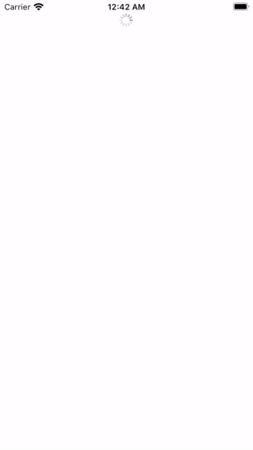
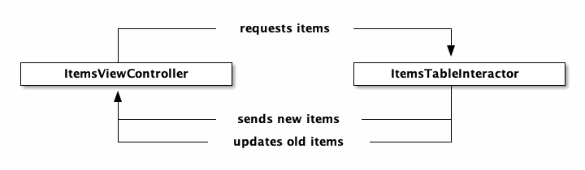

ItemsTable
==========

An example project, illustrating table filling and update.

Screen
------

Diagram
-------

<!--
            +------------ requests items ------------+
            |                                        |
            |                                        V
+-----------+-------------+              +-------------------------+
|   ItemsViewController   |              |  ItemsTableInteractor   |
+-----------+-------------+              +-----------+-------------+
            ^                                        |
            |                                        |
            +------------ sends new items -----------+
            |                                        |
            +----------- updates old items ----------+
-->

